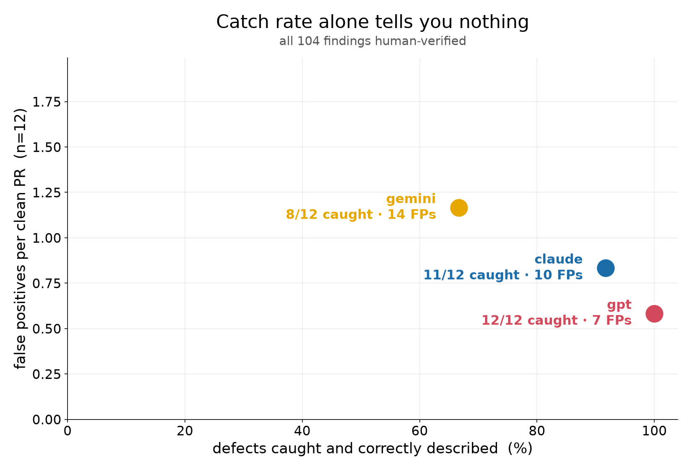
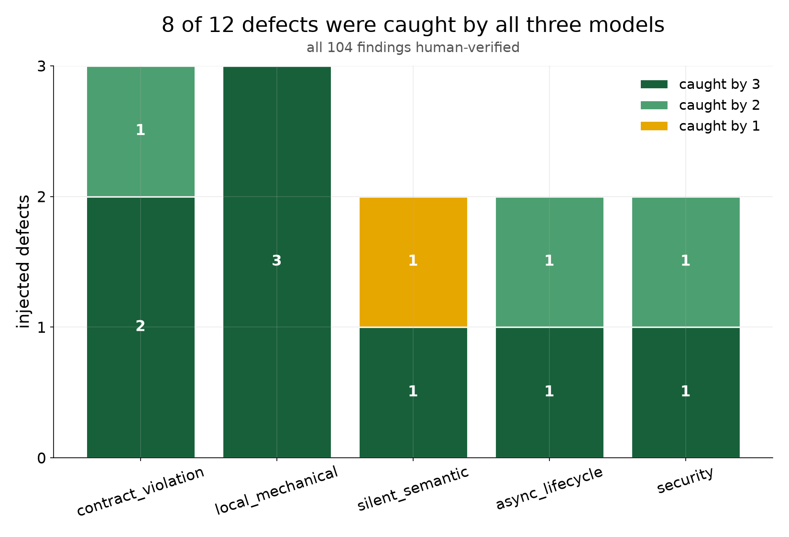

# Who Reviews the Reviewer?

Does an LLM code reviewer catch real bugs — and how often does it invent ones
that aren't there? `phantombench` answers that for one target repo at a time:
it takes real merged PRs, injects a synthetic defect into half of them,
sends the diff alone to several models, and scores what comes back.

The headline finding isn't a leaderboard. It's that **models fabricate
findings with the same confidence they use for real ones** — a `blocking`
severity tag looks identical whether the finding is true or invented. Catch
rate alone hides that. Grading a reviewer for false positives turns out to
be the hard part of this project, harder than the injection or the prompt.

## Results (langfuse-python, 12 PRs × 3 models, n=12)

Paired design: 12 injected defects and the same 12 PRs unmodified, reviewed
by claude-sonnet-4.5, gpt-5, and gemini-2.5-pro from the diff alone, temperature 0.

| model | described the defect | false positives / clean PR | real bugs found on clean PRs |
|---|---|---|---|
| claude | 11/12 (92%) | 0.83 | 4 (3 distinct — two rows share a root cause) |
| gpt | 12/12 (100%) | 0.58 | 0 |
| gemini | 8/12 (67%) | 1.17 | 0 |




Claude's 4 "true finding" rows (all on clean, unmodified PRs) are real,
hand-verified bugs still on `langfuse-python`'s `main` as of 2026-08-24 —
none had an upstream issue filed. Two of the four share a root cause (a
serializer depth cap that's bypassed on two different code paths), so the
honest count is **3 distinct bugs**, not 4. Nobody else — not gpt, not
gemini, not this PR's own bot reviewers — found any of them.

Full numbers, cost, and per-defect-class breakdown: [`reports/summary.md`](reports/summary.md).

## Quickstart

```bash
git clone https://github.com/nbryans/phantombench.git
cd phantombench
uv sync
cp .env.example .env   # fill in GITHUB_TOKEN and OPENROUTER_API_KEY
```

`GITHUB_TOKEN` needs no special scopes — it's only there to lift GitHub's
unauthenticated rate limit for `scrape`. `OPENROUTER_API_KEY` is one key
that routes to all three configured models.

```bash
uv run phantombench scrape --pr 1811   # pull one specific merged PR
uv run phantombench inject --defect 001-exclude-none
uv run phantombench review --unit 001-exclude-none   # one unit, one call, printed inline
```

The full pipeline (`scrape` a batch → `inject` all 12 defects → `review` the
whole matrix → `score` → `annotate` → `report`) is what produced the numbers
above. Every stage caches its output on disk under `data/`, which is
committed here — so the full run behind that table is auditable without
re-spending API budget — and every stage is safe to re-run, skipping
anything already present.

## Point this at your own repo

Editing `config.yaml`'s `repo:` block is the whole on-ramp:

```yaml
repo:
  owner: your-org
  name: your-repo
```

Then:

```bash
uv run phantombench scrape --batch 40   # curate candidate PRs into data/prs/
uv run phantombench review              # every scraped PR, reviewed clean, no defects authored
uv run phantombench score
uv run phantombench annotate            # hand-tag the worksheet in a browser
uv run phantombench report
```

With no `--unit`, `review` reviews every clean unit it can find under
`data/prs/` — which, before you've written any `inject` defects, is every
PR you scraped. That's a false-positive-rate check on your own repo with
zero authored defects, using only `scrape` + `review`. Writing defect
patches under `defects/` (see the 12 in this repo for the shape) and running
`inject` is what adds the other half of the paired design — a defect the
reviewer is supposed to catch.

## Adding a model

Every model here is routed through OpenRouter's OpenAI-compatible endpoint,
so a fourth model is a new entry in `config.yaml`'s `models:` list, not a
new provider client:

```yaml
models:
  - id: my-model
    provider: openrouter
    model: some-org/some-model-slug
```

Verify the slug against [openrouter.ai/models](https://openrouter.ai/models)
before a full run — providers rename and deprecate model IDs. `phantombench
review --model my-model` runs just that one; omitting `--model` runs all
configured models.

## How scoring works

`phantombench score` writes `data/scores/worksheet.csv`, one row per
model finding (plus a placeholder row for empty/unparsable responses). Each
row gets a `draft_tag` and `draft_rationale` — a model's own best guess at
how to score itself, from a taxonomy of `described_catch`, `localized_catch`,
`miss`, `false_positive`, `unrelated`, `true_finding`, `nit`, `none`.

`phantombench annotate` opens a local web UI for a human to commit the real
`tag`. The draft is **withheld from the browser until a tag is committed**,
enforced server-side — the point is to avoid anchoring the human scorer on
the model's own self-assessment before they've formed an independent
judgment. `phantombench report` refuses to drop the `PROVISIONAL` watermark
from its charts until every row has a human tag.

## Honest limitations

- **n=12.** One target repo, one prompt, one temperature. These numbers are
  a case study, not a statistically powered claim about any model in general.
- **Diff-only review.** Models see the unified diff and nothing else — no
  repo checkout, no ability to jump to a definition. That's a harder task
  than most reviewer bots run in practice, and it's a deliberate choice, not
  an oversight: it isolates what the diff alone can tell you.
- **Synthetic defects.** The 12 injected defects are hand-authored, one per
  defect class, based on real patterns but not real regressions. A model
  tuned on "PR review" data may pattern-match the injection style itself.
- **A curated target.** `langfuse-python` was chosen for a permissive
  license, an active merge history, and merged PRs covering all five defect
  classes — and because I work with Langfuse day to day. That familiarity is
  what makes hand-grading feasible, and it is also a bias: I know this
  codebase better than I would a repo picked at random.
- **Model-drafted, human-verified scoring.** The `draft_tag` step used
  Claude to draft a score for every finding — including Claude's own
  findings. The human tag is the one that counts, and blind-scoring is
  enforced in code (see above), but the draft was never independently
  produced by a second model.
- **Real bugs, not exhaustively audited.** The 4 `true_finding` rows were
  spot-verified by hand with a runnable repro where practical; the rest of
  each clean PR was not audited line-by-line, so the true false-negative
  rate against real bugs (as opposed to injected ones) is unknown.

## What's next

- Score against **real regression-tagged bugs** (a repo's actual revert/fix
  commits) instead of only hand-injected ones, to see whether catch rate on
  synthetic defects predicts catch rate on the bugs that actually shipped.
- File upstream issues for the 3 distinct real bugs this run surfaced.
- A second model drafting scores independently, to check the `draft_tag`
  step itself for the same fabricate-with-confidence failure mode this
  project measures in reviewers.

## Repo layout

```
config.yaml              target repo, models, scrape/review knobs
defects/                 12 hand-authored defect patches + ground truth YAML
prompts/review_rubric.md the exact prompt sent to every model
src/phantombench/         scrape, inject, review, score, annotate, report, demo, cli
data/                    scraped PRs, run outputs, hand-scored worksheet
reports/                 finalized summary.md and charts
```

## License

MIT — see [`LICENSE`](LICENSE).

The benchmark's target repository, `langfuse-python`, is MIT-licensed, and
its source appears here inside `defects/*.patch` and `data/prs/*/diff.patch`.
See [`THIRD_PARTY_NOTICES.md`](THIRD_PARTY_NOTICES.md) for that attribution
and for terms covering the recorded model outputs under `data/runs/`.

The patches under `defects/` are deliberately incorrect code, authored as
benchmark fixtures. Do not apply them to a real installation.
